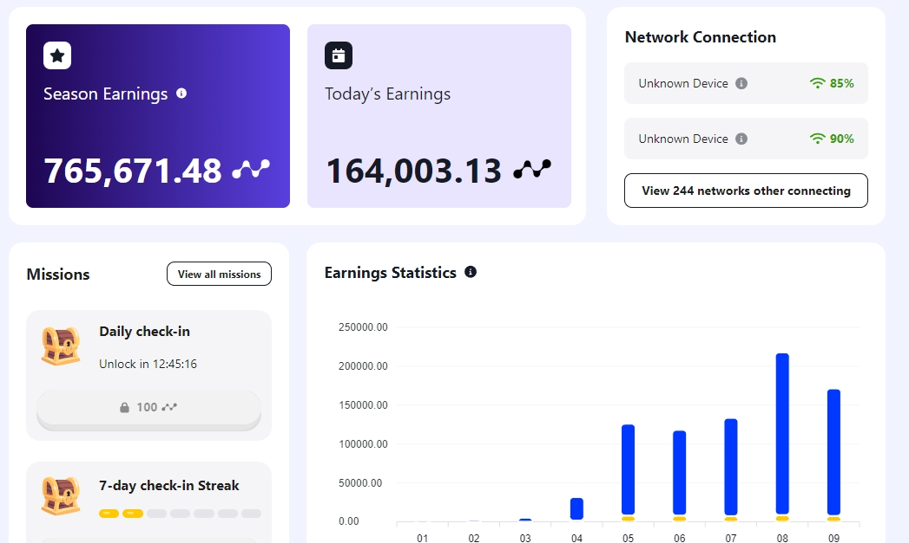
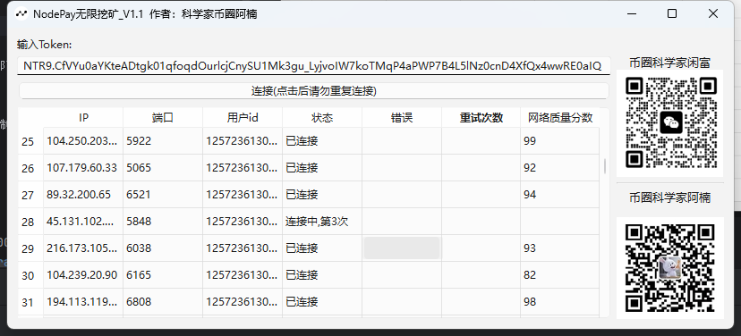
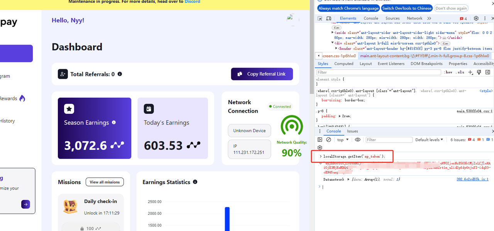
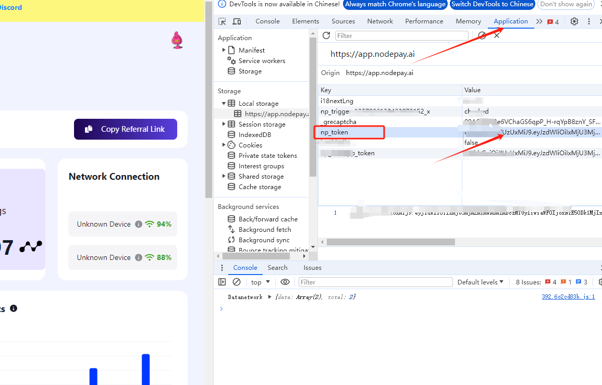
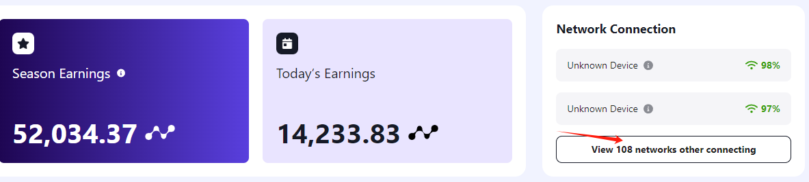

# NodePay Bot [v1.2]

## 版本记录
- v1.2版本支持官方最新协议

## 说明

- 无需账号密码 全自动挂机挖 Nodepay 积分;
- 支持单账号无限ip, 自备socks 代理, 单ip 每天平均 1000分+;
- 支持自动重连
- 添加代理：proxy.txt文件 一行一个ip

## 提供测试卡密自行测试

## 注册(使用我的邀请码免费送一些卡密)
- 必须使用邀请码才能注册, 可以使用我的或者朋友的都可：https://app.nodepay.ai/register?ref=pPflvJLywbBtc9L

## 获取np_token
- 第一种方法：登录页面右键检查 或者 按F12 打开控制台, 在console输入 `localStorage.getItem('np_token');`

- 第二种方法：查看application, 复制np_token

## 自用ip推荐
- 我测试期间使用的是 2.99$/100个socks代理，250G流量，用着还不错，根据自己需求选择
- 邀请链接：https://www.webshare.io/?referral_code=hnxs4s1jlfeg

## 有任何问题联系

